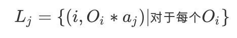

# 数据库课程设计
> 2016.6.4 Create  
> 2016.6.5 Update  
> 算法流程分解以及分工  
> 成员：陈锐煌，胡弘康，冯爽，王禹尊，赵明宇

## 一、算法目的
依据数据库构建一个可以查询出输入对象近似最近邻对象的系统，需要通过B+树索引、外排序等手段进行优化，并对算法索引大小、索引时间、精确度、总I/O次数、运行时间等进行评估。

### 输入
- qn个需要查询的d维向量 (qn = 100, d = 784)
- 数据集，包含n个向量(n = 60000) 记作 `O1, O2, … , On`

### 输出
- 每次查询对应的输出近似d维最近邻向量(d = 784)
​            

## 二、算法流程分解

### 粗略流程分析
- 利用*Box Muller算法*随机生成m个d维符合正态分布的向量(m = 50, d = 784) 

记作 `a1, a2, ... , am`

    //  c++
    //  可以考虑实现这样一个函数
    //  接收一个数组指针参数，把生成的向量存进指针指向的二维数组中
    //  Function Prototype
    void createVector(int a[][784]);
    //  or void createVector(int (*a)[784]);

- 投影操作：对于每一个向量 `Oi` 分别在m个随机生成的向量 `aj` 上做投影。所有投影完成后，对于每个 `aj` 向量，可以得到一个集合

因此一共有50个这样的集合，每个集合中有60000个二元组。

    //  步骤：读入文件，生成二元组<i, distance>, 此处应用到结构体存放，每个集合的存储方式未知
    //  需要一个函数从文件读出每一个向量并解析成标准形式
    //  还需要一个函数将向量进行投影
    class LItem {
      public:
        LItem(int index = -1, int value = -1) : index_(index), value_(value) {}
      private:
        int index_;
        int value_;
    }

- 对每一个 `Lj` 依照二元组中的第二维 `Lj[1]` 进行升序排序。
- 构建B+树索引：通过块载入的方式分别构建m棵建在每一个 `Lj` 上的B+树。
- 将待查询向量 `q` 也在 `a1, a2, ... , am` 上进行投影(点乘)。得到 `(q1, q2, ... qm)`
- 使用*中排名算法*：利用B+树搜索近似最近邻，找到结果向量的编号k（PPT和PDF资料中有具体介绍以及伪代码）。
- 根据k计算出该结果向量在数据库中的位置，并将结果输出。

### Bulk Loading 算法细节    
1. 输入：已按照第二维排好序的`Lj`集合。
2. 拆分成                   

## 三、任务拆分
- 随机生成向量算法实现
- 投影操作实现
- 数据集访问接口的实现
- `Lj` 构建的实现
- `Lj` 外排序函数实现
- B+树构建，包括块载入和查询功能
- MEDRANK算法实现

​          
## 四、人员分工
- 陈锐煌：随机向量生成以及投影等零散操作
- 冯爽：算法性能分析与评估
- 胡弘康 & 赵明宇：B+树索引等实现、使用与测试
- 王禹尊：实现应用于L集合的多路归并外排序

## 五、遗留问题
1. 代码中允许使用的最大内存是多少？——问TA
2. 存储在文件中的格式。                       ——具体实现时思考

## 六、参考资料
- TA 给出的PPT以及PDF算法介绍
- [C语言文件读写操作详解](http://www.cnblogs.com/whiteyun/archive/2009/08/08/1541822.html)